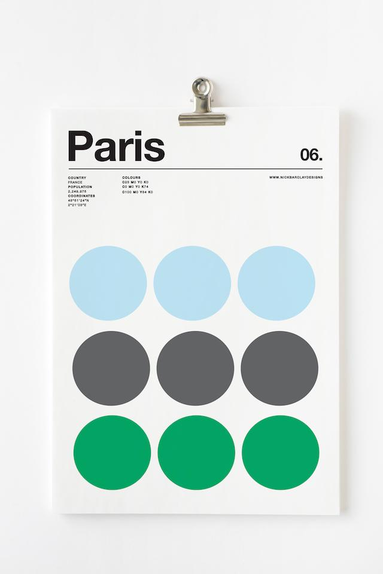

# SCSS MasterClass

(S)CSS Layout MasterClass: Flexbox & Grid

## Day 2

👇 Click the goal image  

 
 

## FLEXBOX FROGGY

## Flexbox:

- [x] flex-direction
- [x] flex-wrap
- [x] justify-content
- [x] align-items
- [x] align-content
- [x] order
- [x] flex-grow
- [x] flex-shrink
- [x] flex-basis
- [x] align-self
- [ ] flex-flow

 

## Grid:

- [ ] grid-template-columns
- [ ] grid-template-rows
- [ ] grid-template-areas
- [ ] grid-template
- [ ] grid-column-up
- [ ] grid-row-gap
- [ ] grid-gap
- [ ] justify-items
- [ ] align-items
- [ ] justify-content
- [ ] align-content
- [ ] grid-auto-rows
- [ ] grid-auto-flow
- [ ] grid-column-start
- [ ] grid-column-end
- [ ] grid-row-start
- [ ] grid-row-end
- [ ] grid-column
- [ ] grid-row
- [ ] justify-self
- [ ] align-self

### Keywords & Functions:

- [ ] repeat
- [ ] min-content
- [ ] max-content
- [ ] minmax
- [ ] auto-fit
- [ ] auto-fill

## SCSS:

- [ ] Variables
- [ ] Nesting
- [ ] Partials
- [ ] Mixins
- [ ] Extend
- [ ] Responsive

## To Clone:

- [ ] (영화 웹) https://besthorrorscenes.com
- [ ] (쇼핑몰) https://paint-box.com
- [ ] (포트폴리오) http://10x19.co/
- [ ] (포트폴리오. 프랑스) http://www.z-o-o.fr/
- [ ] (쇼핑+포트폴리오. 호주) https://schwartzmedia.com.au
- [ ] (쇼핑몰. 덴마크) https://tolv.dk
- [ ] (포트폴리오) https://rodicdavidson.co.uk
- [ ] (포트폴리오. 독일) https://beige.de
- [ ] (개인. 이력서) https://donicaida.com
- [ ] (단체 소개 웹) https://canalstreet.market
- [ ] (쇼핑몰) https://wonhundred.com/
